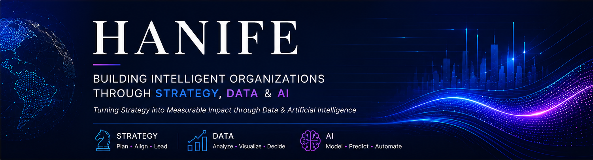

<p align="center">
  
</p>
<div align="center">

# HANIFE

### Strategy • Business Intelligence • Artificial Intelligence

### Building Intelligent Organizations through Data & AI


<br>


</div>

---
# 🎯 Executive Introduction

MBA professional specializing in strategy, business intelligence, and data-driven organizational transformation.

My professional focus lies at the intersection of business strategy, business intelligence, data analytics, and artificial intelligence.

I am passionate about designing intelligent systems that help organizations make better decisions, improve performance, and create sustainable value through data-driven thinking.

---
## 🧭 Professional Identity

I am an MBA graduate with a multidisciplinary background spanning **strategy, business intelligence, data analytics, and artificial intelligence**.

My work focuses on helping organizations transform data into actionable insights, strategic decisions, and measurable business outcomes.

Currently, I am expanding my expertise in **Deep Learning**, **Data Engineering**, and **AI-driven decision intelligence** while building practical solutions that bridge business and technology.

---
## 🏛 Executive Capabilities

| Strategy | Data | Artificial Intelligence |
|-----------|------|-------------------------|
| Strategic Planning | Data Analytics | Machine Learning |
| KPI & Performance Management | Business Intelligence | Deep Learning *(Current Focus)* |
| Process & Policy Design | Business Data Visualization | AI-Driven Decision Intelligence |

---

### 💡 Value Proposition

I combine **business strategy**, **analytics**, and **artificial intelligence** to design data-driven solutions that improve organizational performance and support better decision-making.

---
## 🛠 Technology Stack

<table>
<tr>

<td valign="top" width="25%">

### 💻 Programming

<p align="center">

</p>

Python for data analysis, automation, machine learning, and backend development.

</td>

<td valign="top" width="25%">

### 📊 Data & AI

<p align="center">

</p>

Data analysis, machine learning, statistical modeling, and deep learning.

</td>

<td valign="top" width="25%">

### ⚙ Backend

<p align="center">

</p>


Building scalable APIs and intelligent backend services.

</td>

<td valign="top" width="25%">

### 🗄 Data & Development

<p align="center">

</p>

Databases, version control, development, and experimentation.

</td>

</tr>
</table>

---
## 🌟 Signature Expertise

I specialize in connecting **business strategy** with **business intelligence**.

My approach combines:

- 🏛 Strategic Planning
- 📊 Business Intelligence
- 📈 Data Analytics
- 🤖 Machine Learning
- 🧠 AI-Driven Decision Support
- ⚙ Organizational Systems Design

to help organizations make smarter, faster, and evidence-based decisions.

---
## 🚀 Portfolio Roadmap

The repositories below represent my professional roadmap and ongoing work. Each project is designed to solve practical organizational challenges through strategy, business intelligence, data analytics, and artificial intelligence.

| Project | Focus Area | Status |
|----------|------------|--------|
| 📊 Executive KPI Dashboard | Executive KPI Monitoring & Performance Management | 🚧 In Progress |
| 📈 Business Intelligence Dashboard | Executive Reporting & Business Insights | 🚧 Planned |
| 🤖 AI Decision Support System | AI-Powered Decision Intelligence | 🚧 Planned |
| 🧠 Machine Learning Portfolio | Predictive Analytics & Machine Learning Applications | ✅ Ongoing |
| 🌐 Deep Learning Portfolio | Deep Learning & Neural Network Applications | 🚀 Current Focus |
| ⚙ Business Process Automation Toolkit | Intelligent Process Automation with Python | 🚧 Planned |

---
## 📌 Current Focus

I'm currently focused on expanding my expertise in:

- 🧠 Deep Learning
- 📊 Advanced Business Intelligence
- 🏗 Data Engineering
- 🤖 AI-powered Decision Support Systems
- 📈 Predictive Analytics
- ⚙ Intelligent Process Automation

My objective is to combine strategic management principles with modern AI technologies to build intelligent, data-driven organizations.

---
## 📚 Learning Journey

```text
MBA
 │
 ▼
Strategy
 │
 ▼
Business Intelligence
 │
 ▼
Data Analytics
 │
 ▼
Machine Learning ✔
 │
 ▼
Data Engineering
 │
 ▼
Deep Learning 🚀
 │
 ▼
AI-Driven Decision Intelligence
 │
 ▼
Intelligent Organizations

```

> **Continuous learning is the foundation of sustainable innovation.**

---
---
## 🎯 Areas of Interest

I enjoy working on projects that combine strategic thinking with modern technology, particularly in areas where data can improve organizational performance and decision-making.

### Current Areas of Interest

- 🧠 Artificial Intelligence
- 📊 Business Intelligence
- 📈 Data Analytics
- 🤖 Machine Learning
- 🌐 Deep Learning
- 🏗 Data Engineering
- 📑 Policy Analytics
- ⚙ Intelligent Process Automation
- 📉 Decision Intelligence
- 🏛 Organizational Strategy

---
## 🌍 Professional Vision

My long-term vision is to contribute to organizations that embrace evidence-based management, intelligent systems, and responsible artificial intelligence.

I aspire to bridge the gap between **business strategy**, **data science**, and **AI**, enabling institutions to make better decisions, improve operational performance, and create sustainable impact.

---
## 🏆 Professional Highlights

- 🎓 Master of Business Administration (MBA)
- 📊 Business Intelligence & Data Analytics
- 🧠 Machine Learning Practitioner
- 🌐 Deep Learning (Current Learning Focus)
- 🏛 Strategy & Organizational Systems
- 🤖 AI-Driven Decision Intelligence
- 
---
## 📊 GitHub Analytics

<div align="center">


</div>

<br>

<div align="center">


</div>

<br>

<div align="center">


</div>

---
## 🎯 Career Objective

I seek opportunities to contribute to organizations where strategy, business intelligence, and artificial intelligence converge to create measurable business impact.

My long-term goal is to design intelligent systems that transform data into strategic advantage and sustainable organizational growth.

---
## 📈 Professional Impact

I believe technology creates value only when it solves real organizational challenges.

My goal is to transform:

- 📊 Data into Insights
- 📈 Insights into Strategy
- 🏛 Strategy into Action
- 🤖 AI into Organizational Intelligence

Every project I build is designed with measurable impact, scalability, and long-term value in mind.

---
## 🌐 Open to Collaboration

I welcome collaboration on projects related to:

- Business Intelligence
- Data Analytics
- Machine Learning
- Organizational Strategy
- AI-Driven Decision Support
- Process Automation

If our interests align, feel free to connect or collaborate.

---
## 🌍 Connect With Me

<div align="center">

<a href="mailto:f.r.hanafi786@gmail.com">

</a>

<a href="https://linkedin.com/in/FatihalrahmanHanife">

</a>

</div>

---
## 📖 Philosophy

> **"Data reveals patterns.  
> Strategy gives direction.  
> Artificial Intelligence accelerates impact."**

---
<div align="center">

### Thank you for visiting my profile!

Building intelligent organizations through

**Strategy • Business Intelligence • Data Science • Artificial Intelligence**

⭐ If you find my work interesting, feel free to explore my repositories and connect with me.

</div>

---
